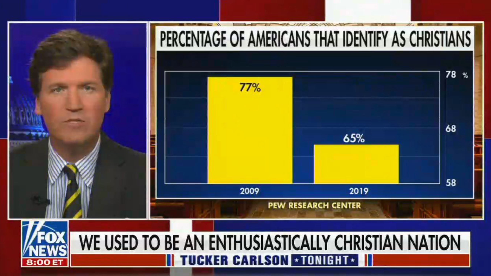
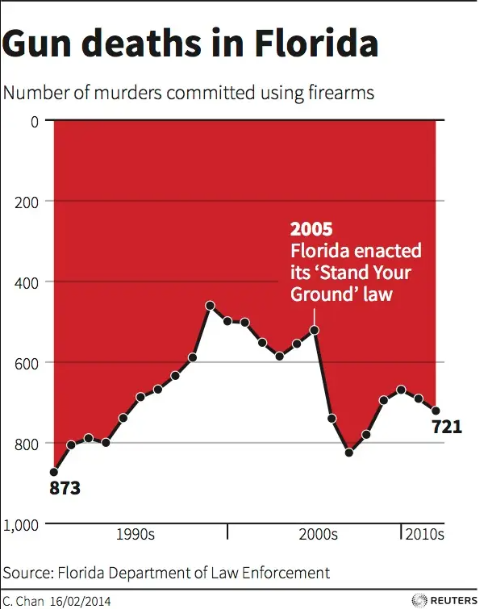

## Assignment 11 - Task 1
#### Student name: Tuan Nguyen - G01346722

### 1.Example of distortion or unnecessary detail in a visualization
URL: https://www.ft.com/content/c9d1c252-6a6e-4fe1-8295-32ac157e2c9b  
Original URL: https://video.foxnews.com/v/6274513508001#sp=show-clips  

  

The original image is displayed during a debate broadcasted on Fox News. The graph shows the percentage of American that identify as Christian in year 2009 and 2019. At first glance, we can see a clear decrease (over 50%) in the bar chart between the year 2009 and 2019. However, this is a clear example of graph distortion, as the 2 numbers are 77% and 65%, which has smaller difference. This distortion is done by adjusting the Y-axis to start from 58%, which makes 1 column a lot higher than another. A simple fix for this distorion would be to start the y-axis at 0% instead of 58%.  

### 2. Example of misleading interpretation
URL: https://www.businessinsider.com/gun-deaths-in-florida-increased-with-stand-your-ground-2014-2  

  

The graph was constructed using data from Florida Department of Law Enforcement. At first glance, we can see that after the enactment of Florida's "Stand Your Ground" law, the graph trend decrease significantly, implying that the law reduce the number of murder committed by firearm. However, at closer inspection, we can see that the Y-axis has been manipulated, and is inverted compare to the normal convention. This leads to the impression that the gun law helped decrease the number of murder, while in fact it triggered an increase in firearm murder cases. A simple fix for this bad graph would be to revert the inverted Y-axis.